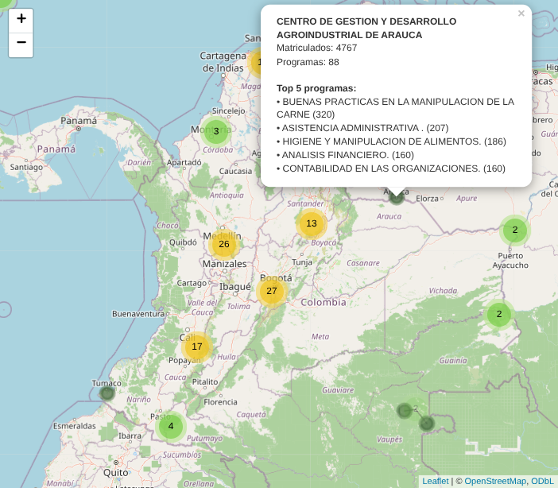
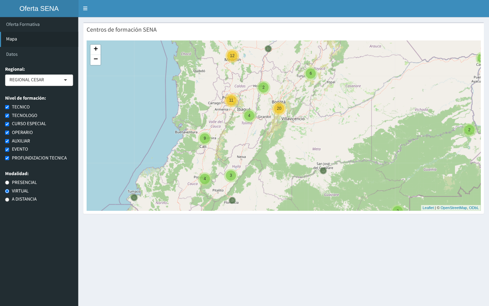
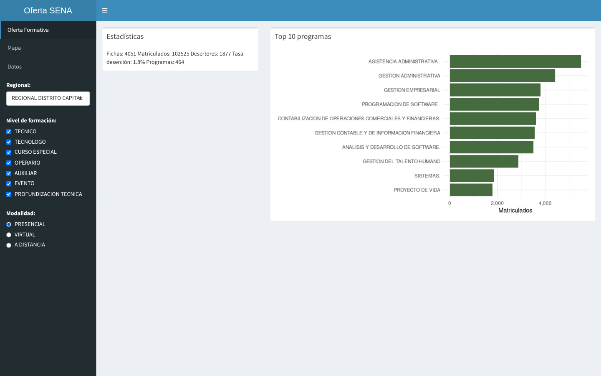
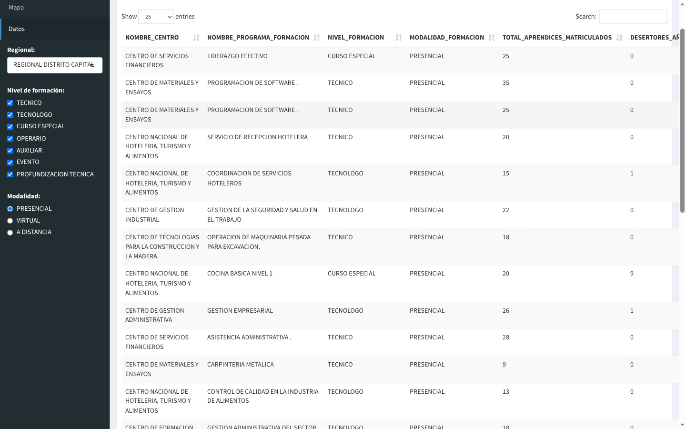
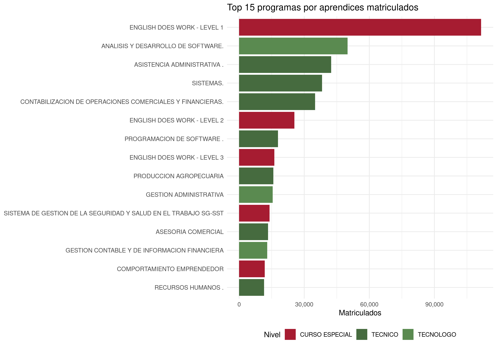
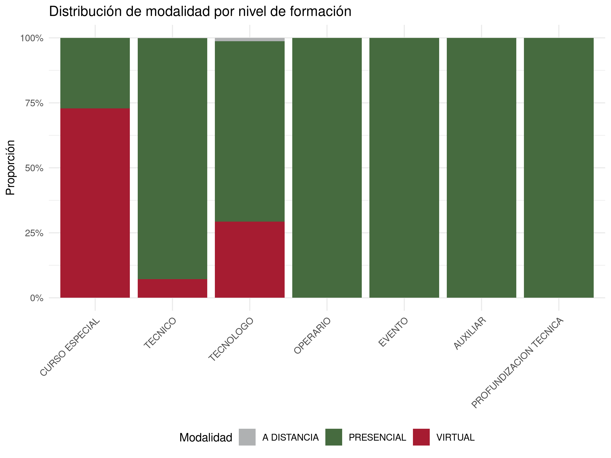
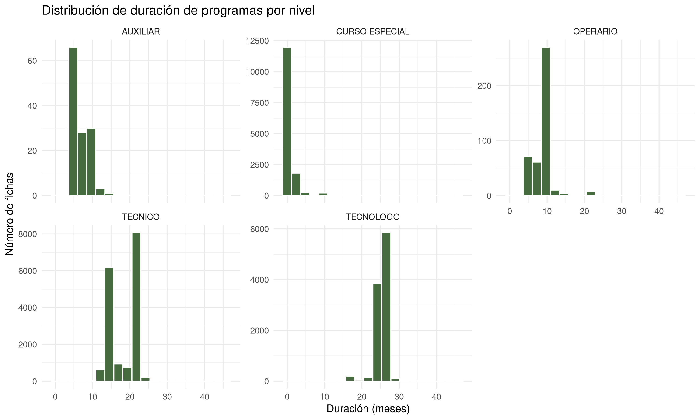
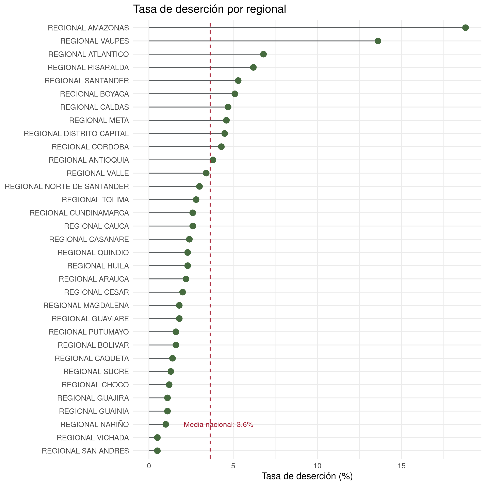

# Análisis y mapeo de la oferta formativa del SENA

### 🌐 Demo en vivo: **[jaucor.online/sena](https://jaucor.online/sena/)**

[Mapa interactivo](https://jaucor.online/sena/mapa.html) · [Reporte con el modelo predictivo](https://jaucor.online/sena/reporte.html)

---

Aplicación web interactiva que organiza, analiza y **mapea geográficamente** la oferta de
formación profesional del SENA a partir de datos abiertos de
[datos.gov.co](https://www.datos.gov.co/). Incluye un dashboard con filtros reactivos, un
mapa de los 118 centros de formación del país, un reporte reproducible y un modelo
predictivo de deserción.

Cubre el ciclo completo: descarga → depuración y validación → análisis → visualización →
publicación web. Todo con software libre.

## Mapa de centros de formación

Los 118 centros del SENA georreferenciados sobre OpenStreetMap, con agrupamiento
automático por densidad. Cada marcador abre un popup con los matriculados del centro, su
número de programas y el top 5 de programas por matrícula.

[](https://jaucor.online/sena/mapa.html)

*El mapa está publicado y navegable en [jaucor.online/sena/mapa.html](https://jaucor.online/sena/mapa.html).*

El agrupamiento es dinámico: al acercarse, los conglomerados se subdividen y revelan los
centros individuales. Bogotá pasa de 27 a 20 centros, Medellín de 26 a 12.



## Dashboard interactivo

Panel construido con Shiny y shinydashboard. Los filtros de la barra lateral —regional,
nivel de formación y modalidad— recalculan en vivo las estadísticas y las gráficas.



Vista de datos con tabla paginada, ordenable y con búsqueda sobre el dataset filtrado:



## El dataset

| | |
|---|---|
| Fichas de formación | 42.080 |
| Aprendices matriculados | 1.447.204 |
| Desertores | 52.579 |
| Tasa global de deserción | 3,6 % |
| Regionales | 33 |
| Centros de formación | 110 (118 georreferenciados) |
| Programas únicos | 2.153 |

Fuente: *Deserción de la Formación Profesional Integral* (SENA, `u4ze-bi7k`) y el listado
de sedes con coordenadas. Período 2024-02.

Una **ficha** es un grupo de aprendices inscritos en un programa, en un centro, con fecha
de inicio y de terminación — no un registro por aprendiz.

## Depuración y validación de los datos

El dataset crudo llega con comillas embebidas en los campos de texto, fechas en formato
`DD/MM/YYYY` sin parsear y sin columnas derivadas. El pipeline las corrige:

- **Validación de completitud** — conteo de nulos por columna en ambos datasets
  (`01_carga.R`)
- **Normalización de texto** — se retiran las comillas de los ocho campos afectados
- **Parseo de fechas** con `lubridate`, de texto a tipo fecha
- **Columnas derivadas** — tasa de deserción por ficha, duración en días y en meses, mes y
  año de inicio, e indicador booleano de deserción
- **Cruce entre fuentes** — las estadísticas por centro se unen con las coordenadas por
  `CODIGO_CENTRO`

El resultado queda en `data/sena_limpio.csv`: 42.080 filas × 21 columnas.

## Visualizaciones estáticas

Generadas con ggplot2 en `scripts/03_visualizacion.R`:

| | |
|:--:|:--:|
|  |  |
|  |  |

## Modelo predictivo

Clasificador binario con **tidymodels** que predice si una ficha tendrá desertores a partir
de su nivel, modalidad, regional, duración y número de matriculados. Regresión logística
sobre una partición estratificada 75/25.

**ROC AUC: 0,787** sobre el conjunto de prueba. La línea base es exigente: el 75,7 % de las
fichas no tiene ningún desertor.

## Stack

| Componente | Herramienta |
|---|---|
| Manipulación de datos | `dplyr`, `readr`, `lubridate` |
| Visualización | `ggplot2` |
| Mapas | `leaflet` + OpenStreetMap, con `markerClusterOptions` |
| Aplicación web | `shiny`, `shinydashboard` |
| Reporte reproducible | Quarto |
| Modelado | `tidymodels` |

## Estructura

```
.
├── app/
│   ├── app.R                  # UI y servidor del dashboard
│   └── funciones.R            # Funciones de filtrado y agregación
├── data/
│   ├── desercion_sena.csv     # Dataset crudo
│   ├── sena_limpio.csv        # Dataset procesado (lo genera 02_limpieza.R)
│   └── centros_geo.csv        # Coordenadas de los 118 centros
├── scripts/
│   ├── 01_carga.R             # Carga y validación de completitud
│   ├── 02_limpieza.R          # Depuración, fechas y columnas derivadas
│   └── 03_visualizacion.R     # Gráficas con ggplot2
├── reportes/
│   └── reporte_sena.qmd       # Reporte Quarto con el modelo predictivo
├── graficas/                  # Gráficas y capturas del dashboard
└── docs/                      # Versión publicada (mapa y reporte estáticos)
```

## Cómo ejecutarlo

Requiere R 4.x. Instala las dependencias:

```r
install.packages(c("shiny", "shinydashboard", "leaflet", "ggplot2",
                   "dplyr", "readr", "lubridate", "tidymodels", "scales"))
```

**Todos los scripts y la app se ejecutan desde la raíz del proyecto**, porque las rutas a
`data/` son relativas a ella.

```bash
Rscript -e 'app <- source("app/app.R")$value; shiny::runApp(app)'
```

El dashboard queda en <http://127.0.0.1:PUERTO> (Shiny anuncia el puerto al arrancar).

> `shiny::runApp("app/app.R")` **no** funciona: cambia el directorio de trabajo a `app/` y
> las rutas a `data/` dejan de resolver. Por eso se carga con `source()` desde la raíz.

Para rehacer el pipeline desde cero:

```bash
Rscript scripts/01_carga.R          # validación del dataset crudo
Rscript scripts/02_limpieza.R       # genera data/sena_limpio.csv
Rscript scripts/03_visualizacion.R  # genera las gráficas en graficas/
```

Y el reporte con el modelo (requiere [Quarto](https://quarto.org/)):

```bash
quarto render reportes/reporte_sena.qmd
```

## Publicación

El mapa se exporta a un HTML autocontenido que conserva zoom, agrupamiento y popups sin
necesidad de un servidor R:

```bash
Rscript scripts/04_exportar_mapa.R   # genera docs/mapa.html
```

El contenido de `docs/` es lo que está publicado en
[jaucor.online/sena](https://jaucor.online/sena/), servido como estático por nginx sobre
una VM de Google Cloud. No requiere R en el servidor.

## Contexto

Proyecto guiado del curso **R con Software Libre** de la Universidad Nacional de Colombia.
Integra los cuatro módulos del curso: estadística con dplyr, visualización con
ggplot2/leaflet, reportes reproducibles con Quarto y modelado con tidymodels, y aplicaciones
web con Shiny.

## Licencia

MIT — ver [LICENSE](LICENSE).

Los datos son públicos, propiedad del SENA, publicados en datos.gov.co bajo los términos de
ese portal.
